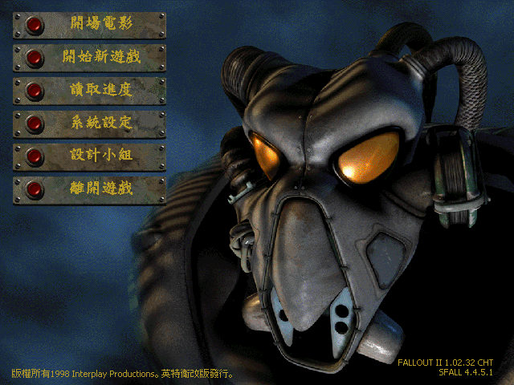

# 異塵餘生2 非官方修正繁體中文語言包

英特衛（Interwise）當年[官方繁中版翻譯修正檔](https://web.archive.org/web/20010128163400/http://www.interwise.com.tw/FALLOUT/FALLOUT2/f2cpatch.htm)內的`patch000.dat`實際上包含了遊戲幾乎所有的文本。我以它為基底，補齊官方1.02d版缺少的本文和字句，加上gvx的中文化1.02d執行檔與其他所需檔案，以便完全相容於killap的非官方修正（Unofficial Patch，現為[UPU](https://github.com/BGforgeNet/Fallout2_Unofficial_Patch)）。

## 安裝方式

1. 先在原版繁中版遊戲上安裝[非官方修正（UPU）](https://github.com/BGforgeNet/Fallout2_Unofficial_Patch)。
2. 從[發佈頁面](https://github.com/NovaRain/FO2_UP_TChinese/releases/latest)下載最新版的`FO2_UPU_CHT_v*.rar`，將其解壓縮至遊戲目錄並覆蓋所有檔案。\
   **註**：如果你已經有調整過遊戲和sfall的設定，那就不要覆蓋`.cfg`與`.ini`這些設定檔，否則設定會變回初始狀態，但你需要確定`fallout2.cfg`裡面設定為`language=cht`。
3. 如果Winodws的非Unicode程式的語系不是繁體中文，請先確定有安裝繁體中文語言包（要有**細明體**與**標楷體**字型），再用編碼轉換軟體以**Big5**編碼執行遊戲，例如[Locale Emulator](https://github.com/xupefei/Locale-Emulator)或[Ntleas](https://github.com/zxyacb/ntlea)。
4. 如何驗證安裝成功：
   * 主選單右下角會出現非官方修正與sfall版本的字串。
   * 開始新遊戲時，在守衛的克林特身後地上會有一塊石頭，而且檢視它會顯示版本訊息。
   
   

## 額外補充

* 遊戲畫面設定可參考[巴哈姆特](https://forum.gamer.com.tw/C.php?bsn=2023&snA=22586)或[TROW](https://trow.cc/board/showtopic=50933)的文章。
* 遊戲攻略：[The Nearly Ultimate Fallout 2 Guide](https://lemmings19.github.io/fallout-2-walkthrough/)（英文）
